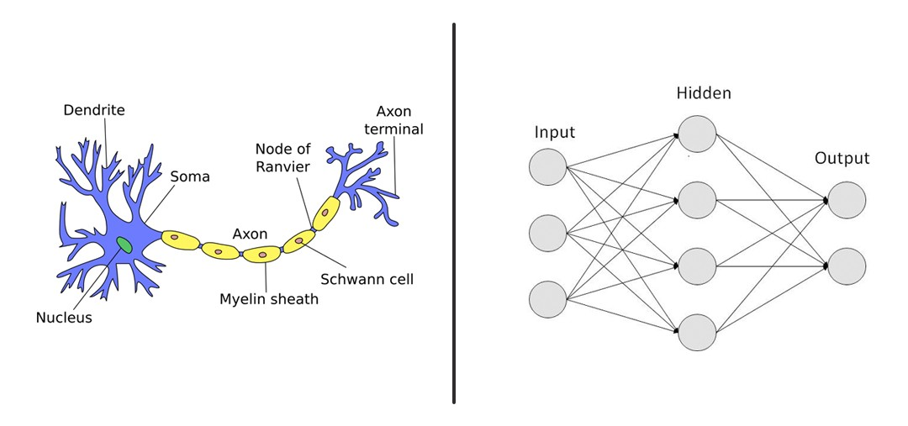
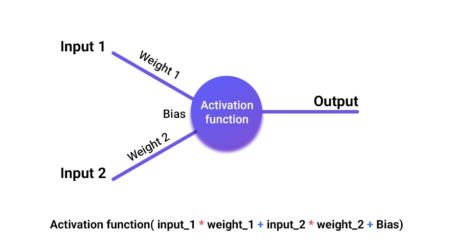
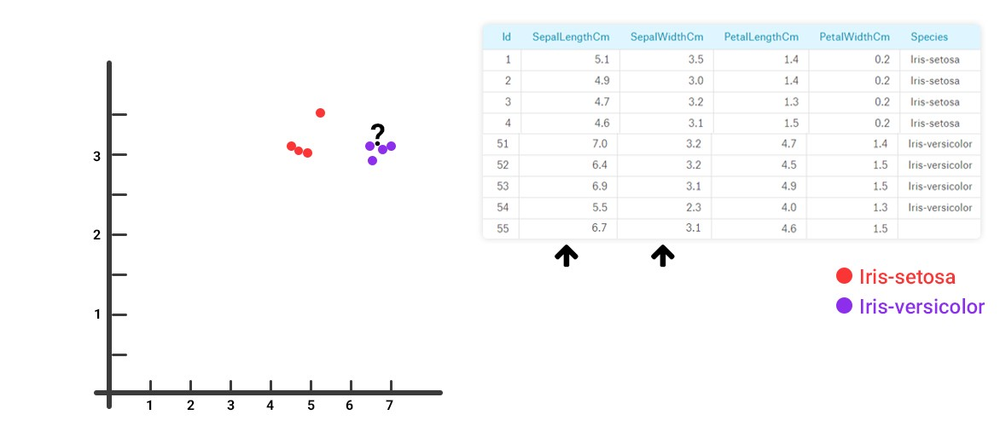
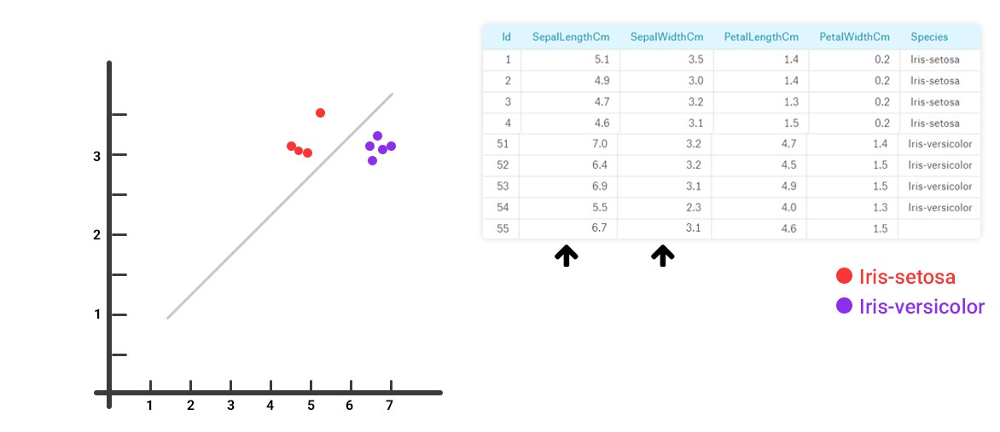
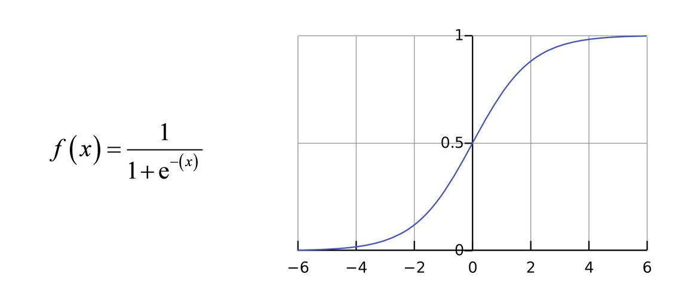
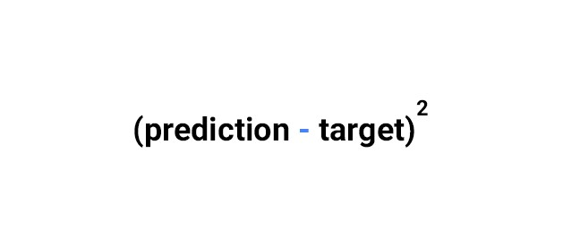
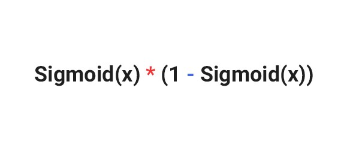
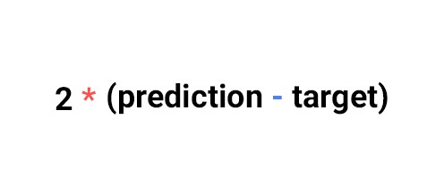
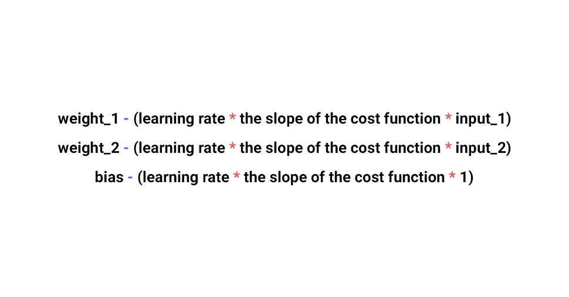

> > “ In the late ’50s, a Cornell scientist named Frank Rosenblatt had proposed the world’s first neural network machine. It was called the Perceptron”

Let’s start by defining the terms first, Ai (Artificial intelligence), ANN (Artificial neural networks), Machine learning & Deep learning.

## Ai

> The field of AI research defines itself as an area of computer science that deals with giving machines the ability to seem like they are intelligent, which we haven’t yet reached since neuroscience haven’t solved intelligence yet.

## ANN

> ANN or a neural net is a computing system inspired by the biological neural networks that constitute biological brains but they look so different.

> ON the left: The biological neuron graph & on the right: the artificial neural network

## Machine learning

> Machine learning is a field within Ai that focuses on the design of algorithms that can learn from a given data and results which we call “training data” to make a prediction based on that given data from new input data.

## Deep learning

> Deep learning is a sub-field within Machine learning which focuses on the same goal but which uses neural networks & deep neural networks.

So what’s the perceptron then ? Well the perceptron is an algorithm for supervised learning (which means we know the result we’re trying to get, say like feeding the size & location of a house to predict the price, in the other hand there is unsupervised learning which is used to draw results from datasets consisting of input data without labeled responses).

The perceptron receives input data multiplied by random weights and adds a bias value, put in an activation function to get a result, if the result value is wrong, it uses back propagation & gradient descent to go back & tweak the weights to get a correct result.

> It can be more than 2 inputs!

I know there are some terms there you didn’t get, so let’s go ahead and explain that slowly, let’s say you’re a farmer and you want to classify two types of flowers manually, the best way to do this manually is to take the length & width of each flowers’ paddle and represent them on a graph just like shown bellow:

> Data was taken from https://kaggle.com

Notice the unknown flower we’re trying to figure its type, as you can see on the graph it’s represented among the type 2 of flowers which means it is a type 2 flower.

What you’ve just did manually is called linear regression, you’ve represented as many flowers you have on the graph as a training data, then you noticed that pattern and drew a line between the two types.

So now let’s automate it using our own perceptron built from scratch, the activation function we’ll be using is Sigmoid, here’s how it looks like on the graph:

> Sigmoid function

Now let’s understand how back propagation & gradient descent work, and to do so we will need:

- The cost function or also known as squared error function

- The derivative of the sigmoid function

- The derivative of the cost function

- The slope of the cost function is: the derivative of the cost function multiplied by the derivative of sigmoid.

- Learning rate: we will go with 0.2

- For the derivatives of the weights, it’s the inputs’ values, — because the derivative of a constant multiplied by a non constant is the constant — & for the derivative of the Bias it’s 1.

- Then we’ll be able to get the new weights & bias values like shown bellow:

> And we're done

Check the code on [Github](https://github.com/smakosh/Perceptron-neural-net-from-scratch/blob/master/Linear_regression_perceptron.ipynb) & [Kaggle](https://www.kaggle.com/smakosh/perceptron-neural-net-from-scratch/notebook)
