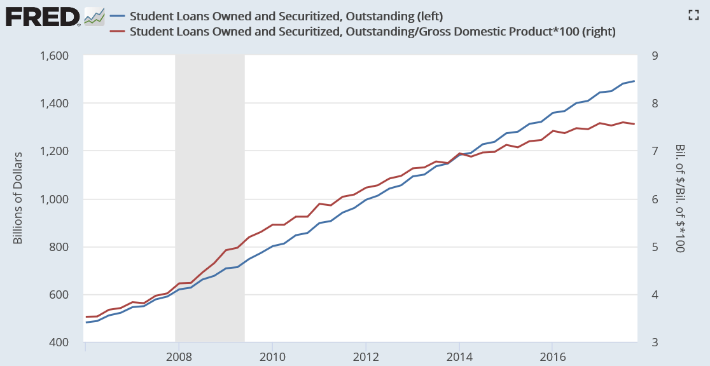

## Life update

If you haven't read my [previous article about the visas rejections](/visa-rejections-stories), I'd recommend you to do so as I mentioned there that I switched my job and the reason behind such decision.

## Caution

⚠️ Please be aware that this doesn't apply or might not work for everyone, luck and other factors play a huge role in this to workout and I'm grateful for being very lucky that it did.

### Students loan debt

We all know and aware of the student loan debt issue in the US, it exceeded \$1.2 trillion in 2014 according to [Wikipedia](https://en.wikipedia.org/wiki/Student_debt#Statistics).

Middle class families are the most impacted ones, as a result, most end up having financial issues even after the graduation of their kids, same applies in other countries but differently.

> you could do your own research for the reasons and causes behind the issue

### Avoiding student loan debt

I will share the approach I took but keep in mind that there are other better and bad approaches, I don't recommend any and I'm just sharing my experience. And keep in mind that I'm based in Morocco which offers the option of a low cost education and you're not forced to study at private schools.

What I basically did is working with international clients while I was studying in a public school after high school, what I could learn today, will apply it tomorrow in exchange of cash. But I had to learn most of the stuff at home as I mentioned in my previous articles.

> I had to sleep at 4am often times.

I kept following that approach but in an exponential way when it comes to the technical side of the work I was doing, meaning that I've almost never done something repetitive and I try to learn to use something new when ever I get a task to work on.

## FAQ

I'm pretty sure most of you will be questioning these questions, so here you go:

But how would you get those clients without any work to showcase?

- I followed few tutorials, made an Intro using After Effects, posted it on YouTube, a videographer based in Canada left a comment which turned into a work, from making the same intro into making 2 brand logos for him and that's how this started. TL;DR, worked on my personal projects, showcased them and that's how it launched.

Based on what do you know what to learn next?

- I've been up to date on what's happening on the web community, I bet entirely on JavaScript and CSS, few factors contributed in that, made take this decision, here are a list of those factors:
  - A friend of mine
  - I started learning the front-end first
  - The rise of Node js that made JavaScript the first cross-platform language
  - It wasn't taught and fully neglected by our educational system, which meant more chances of landing a job in the future.

> If you have more questions, you can add a comment below or DM me on [Twitter](https://twitter.com/smakosh)

## Why working at a startup?

This part is a part 2 of [this article](/one-year-working-remotely)
